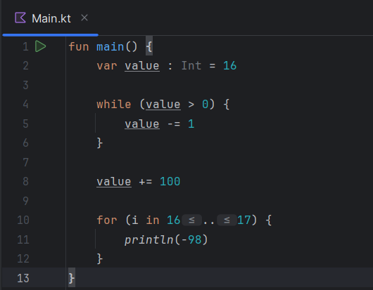
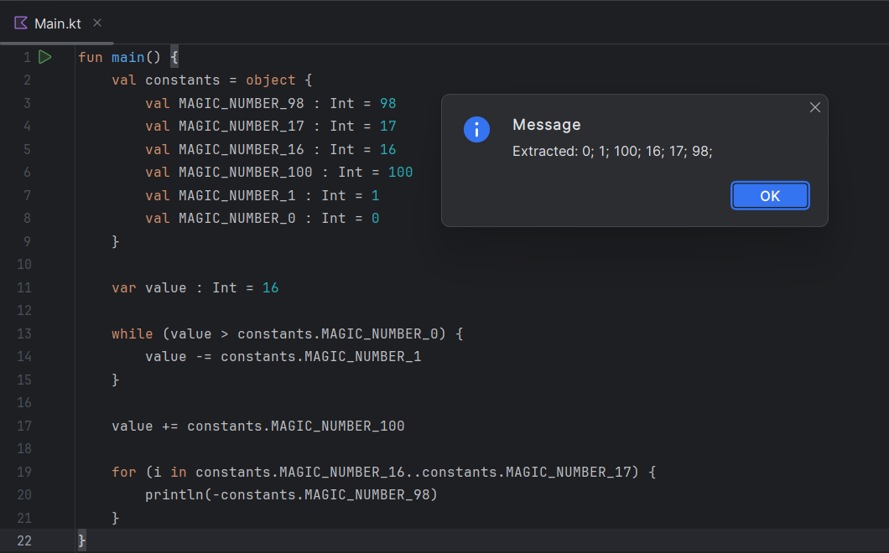

# MNReviewer
> made by Semenov Dmitry, M3100, ISU 409537

## Description

**The plugin makes it easier to refactor code written in the Kotlin programming language. 
It replaces all uninitialized integers with constants of the same type MAGIC_NUMBER_[integer].** 

**Thanks to this plugin, the process of finding and renaming such numbers becomes much easier!** 

## How it works?

**On the IDE toolbar, the plugin adds a new section "Replace All MN". 
Hovering over it, you can see the "Magic Number Review" function.**

**When you click on it, one of three scenarios will occur:**

1. If there are no magic numbers in the file, 
we receive the corresponding message

2. Using the plugin when the file is closed will also result in the message

3. Otherwise, the "constants" object will appear in the file, 
which will store the found magic numbers.
 

## Commits history

| Hash          | Commit name                                        |
|---------------|----------------------------------------------------|
| ***a4c1d6e*** | Initial commit                                     |
| ***80e1be1*** | [Feat] Add functionality for working with integers |
| ***479c5c2*** | [Fix] Duplication of constants bug fixed           |
| ***1da9b84*** | Constants are now declared as an object            | 
| ***e52d42a*** | [Docs] README.md big update                        |